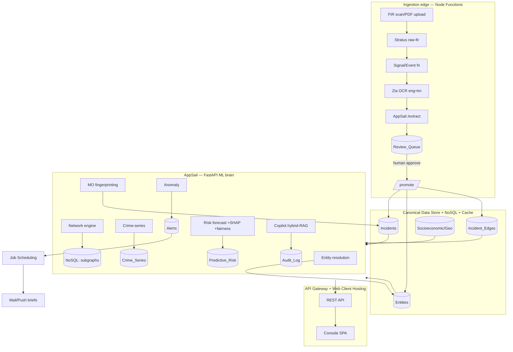

# GARUDA — Technical Requirements Document (TRD)

**Companion to:** [01-PRD](01-PRD.md) · [05-Backend-Schema](05-BACKEND-SCHEMA.md) ·
`docs/GARUDA_BLUEPRINT.md`

---

## 1. Architecture

GARUDA is a layered system: a thin Node ingestion edge, a Python/FastAPI **ML brain** on AppSail
holding all heavy analytics, a canonical Data Store, and a static SPA console. Engines run locally
on CSVs at $0 and switch to the Catalyst Data Store via `GARUDA_BACKEND=zcql` for deploy — *no
engine code changes*.

**Tracks:** A Data/Backend · B AI/ML · C Frontend · D Governance. Build order = the 10-phase plan;
this TRD covers the deepened V1 target.

## 2. Tech stack & Catalyst mapping

| Layer | Tech | Catalyst service |
|---|---|---|
| Ingestion glue | Node 18 | **Functions** (advancedio + event) |
| OCR | Zia OCR (eng+Kannada) | **Zia** |
| ML brain | Python 3.11 / **FastAPI** | **AppSail** |
| Canonical store | ZCQL tables | **Data Store** |
| Vectors / subgraph cache | key-value/doc | **NoSQL** |
| Hot results | TTL cache | **Cache** |
| Object storage | scans, reports, model artifacts | **Stratus** |
| LLM serving (opt-in) | Qwen 2.5-14B | **QuickML** |
| AutoML (opt-in) | risk model | **Zia AutoML** |
| Frontend | static SPA (→React/Vite later) | **Web Client Hosting** |
| Edge routing/auth | gateway + RBAC | **API Gateway** + **Authentication** |
| Automation | crons, signals | **Job Scheduling**, **Signals**, **Mail/Push** |
| CI/CD | push→deploy | **Pipelines** |

**ML libs (all local/free):** numpy, scikit-learn, rapidfuzz, jellyfish, indic-transliteration,
networkx, statsmodels, lightgbm, holidays, pandas. Opt-in (off by default): sentence-transformers,
QuickML/Qwen.

## 3. Components & engines (built)

| Component | Path | Function |
|---|---|---|
| Entity resolution | `app/engines/resolution` | normalize/transliterate → blocking → weighted match → `canonical_id` + confidence; borderline → review |
| MO fingerprinting | `app/engines/mo` | TF-IDF/SVD (+opt SBERT) + structured features → HDBSCAN → `mo_cluster_id` + signatures |
| Network | `app/engines/network` | graph build, degree+betweenness, Louvain, cross-district rings, Adamic-Adar link prediction, ego-JSON |
| Crime-series | `app/engines/series` | MO/crime + space-time near-repeat (Knox) → `Crime_Series` |
| Anomaly | `app/engines/anomaly` | per area×crime monthly robust median/MAD z-score → `Alerts` |
| Forecasting | `app/engines/forecasting` | feature table → LightGBM walk-forward → PAI/PEI/PR-AUC; TreeSHAP; fairness |
| Copilot | `app/engines/copilot` | NL→filters (`nl2query`) + TF-IDF semantic (`retriever`) + cited answer + guardrails (`answer`) |
| Data access | `app/shared/store.py` | local CSV ↔ ZCQL; business keys; all fetch/write helpers |
| API | `app/routers/*` | ingestion + analytics REST |
| Console | `client/` | static SPA (shell, force-graph, SVG map, copilot, dashboards) |

## 4. ML/AI specifications

| Model | Algorithm | Key features | Eval metric | Retrain |
|---|---|---|---|---|
| Entity resolution | blocking (NYSIIS/Metaphone) + Jaro-Winkler weighted score + connected components | name/phonetic/plate/phone normalization, transliteration | precision/recall/F1 vs ground truth (0.946/0.896/0.920) | on ingest batch |
| MO clustering | TF-IDF+TruncatedSVD (or SBERT) + structured cues → HDBSCAN | hour bucket, weapon/vehicle/entry cues, crime type | cluster coherence; gang cluster purity | nightly |
| Network | networkx; betweenness per-component (sampled if huge); Louvain (weight) | co-occurrence + shared phone/vehicle edges | gang recovered as #1 ring | batch + cache |
| Crime-series | union-find over (MO-block × haversine ≤ R × Δt ≤ T) | mo_cluster_id/crime_type, lat/long, time | planted series recall | nightly |
| Anomaly | robust modified z-score (median/MAD), gate z≥3.5 & ratio≥2 | monthly counts per area×crime | planted spikes in top-k | nightly |
| Forecasting | LightGBM binary classifier, **walk-forward** temporal CV | lags t-1/t-7, rolling 7/28, dow/month/holiday, socio | **PAI/PEI**, PR-AUC vs naive baseline | weekly |
| Explainability | LightGBM `pred_contrib` (exact TreeSHAP) | model features | drivers per prediction | per request |
| Fairness | per-ward predicted-vs-actual ratio | ward aggregates | over-prediction > 1.3× flagged | per run |
| Copilot | rules NL→ZCQL + TF-IDF cosine rerank (opt SBERT/Qwen) | narrative + structured | citation accuracy (1.00) | index on data change |

**Principles:** no random splits (time leakage); PR-AUC not accuracy on rare classes; no protected
attributes as features; explainability + fairness mandatory.

## 5. API design

REST over the AppSail brain; same-origin local, **API Gateway** in prod. Conventions: JSON;
`POST /x/run` = (re)compute+persist (`{write,limit}`); `GET` = read cached; business keys not ROWID;
errors `{error, reason}`; parameterized ZCQL (no injection).

| Method · Route | Returns |
|---|---|
| `POST /extract` `/geocode` `/promote` | ingestion (FIR → fields → canonical) |
| `POST /resolve/run` `/mo/run` `/geocode/backfill` | resolution + MO |
| `GET /network/top` `/network/rings` `/network/{id}` · `POST /network/run` | actors, rings, ego-graph, rebuild |
| `POST /series/run` `/anomaly/run` | series + alerts |
| `POST /risk/run` · `GET /risk/top` `/risk/explain` `/risk/fairness` | forecast + SHAP + fairness |
| `POST /copilot` | cited NL answer + guardrails |
| `GET /stats` `/geo/districts` | dashboard + map |
| **V1 add:** `GET /entity/{id}` (dossier) · `GET /search` · `GET/POST /watchlist` · `POST /alerts/*` · `POST /brief/run` · `GET /audit` | dossier, search, watchlist, alert workflow, briefs, audit |

Versioning: `/v1` prefix on deploy. Pagination: `limit`/`offset`. Caching: `Cache` TTL on hot reads
(graph, risk surface); ETag on dossiers.

## 6. Security architecture

- **AuthN:** Catalyst **Authentication** (Web SDK); session token to API Gateway.
- **AuthZ / RBAC:** scopes `scrb-admin` (state) · `district:<code>` · `station:<code>`; queries
  filtered to the caller's jurisdiction; canonical writes require `admin` scope + human approval.
- **RBAC matrix (excerpt):** Exec read-all + model cards; SP read district + tasking; SHO read
  station + BOLO; Analyst read-all (PII-masked) + run engines; IO read assigned + dossiers;
  Admin manage; Ethics read audit + fairness, no case PII edit.
- **PII:** classified per field (see Schema §9); **masked by role** at the API layer
  (e.g., complainant name → initials for non-owning station); never in logs/URLs.
- **Transport/secrets:** TLS; secrets in env/secret store; no creds in repo (`.gitignore`).
- **Audit:** every privileged read/query → `Audit_Log` (actor, role, action, resource, query, ts, ip).

## 7. Performance & scalability

- **Caching:** in-process engine caches (graph/risk/copilot) + Catalyst **Cache** for cross-instance
  hot reads; nightly **Job Scheduling** recompute writes Crime_Series/Alerts/Predictive_Risk.
- **Batch vs realtime:** heavy ML is batch+cached; reads are O(ms). Ingestion is event-driven.
- **Scale guards:** betweenness per-component (sampled if a component > 1.5k nodes); forecasting on a
  dense 271k-cell table trains in seconds; copilot TF-IDF brute-force is instant at 10⁴, FAISS/NoSQL
  vectors for 10⁶.
- **Targets:** see PRD §7.

## 8. Reliability & observability

- **Idempotency:** ingestion dedupes by `source_fir_url`; promote is INSERT-OR-REPLACE on business key.
- **Retries / dead-letter:** circuit steps (OCR→extract→queue→dead-letter) with retry.
- **Monitoring:** structured logs; request metrics; **model-drift** checks (input distribution + PAI
  decay) on scheduled runs; alert on drift.
- **DR:** Stratus holds source scans + model artifacts; Data Store backups; reproducible from generator
  in dev.

## 9. Deployment

- **Envs:** Local ($0, GARUDA_LOCAL) → Catalyst **Dev** → **Production** (console-promoted) +
  **Domain Mappings** + SSL.
- **CI/CD:** **Pipelines** push→deploy; gate on the engine test suite (`tests/test_*`).
- **Build paths:** AppSail bundles `app/`; **reference data must be bundled into `app/` or loaded from
  Data Store/Stratus** (open item — `refs.py` else FileNotFoundError in prod).
- **Frontend:** SPA → Web Client Hosting; API base → API Gateway; auth → Web SDK.

## 10. Key technical decisions (ADRs, condensed)

1. **Canonical schema + adapter** (not direct-to-source) → real-data swap with no engine change.
2. **Business keys, not ROWID FKs** → CSV-generated data + ZCQL joins work; loader can remap.
3. **LightGBM TreeSHAP via `pred_contrib`** → explainability with no `shap`/torch dependency.
4. **TF-IDF hybrid copilot default; SBERT/Qwen opt-in** → $0, no credits; upgrade path intact.
5. **Static SPA now; React/Vite later** → zero build risk for the demo; API+tokens port over.
6. **Predict places×times, not people; fairness mandatory** → ethical + legally defensible.
