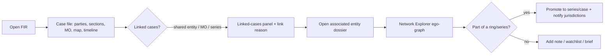

# GARUDA — Application Flow Document

**Companion to:** [01-PRD](01-PRD.md) · [04-UI-UX](04-UI-UX-DESIGN.md)

---

## 1. Information architecture (sitemap)

```
GARUDA Console
├── Dashboard (role-tailored)                         [E1]
├── Investigate
│   ├── Cases (FIR list + filters)                    [E2]
│   │   └── Case file → linked cases, timeline, parties, sections, MO, map
│   ├── Entities (people / vehicles / phones)         [E3]
│   │   └── Dossier (360°: appearances, aliases, associates, history, risk)
│   └── Universal Search (⌘K, full-text+structured+semantic)  [E12]
├── Intelligence
│   ├── Network Explorer (graph, rings, link prediction)      [E4]
│   ├── Crime Series & Patterns (series board, similar-cases) [E5]
│   ├── Hotspot Map (layers, time slider, beats)              [E6]
│   ├── Risk Forecast (surface, SHAP, fairness, patrol)       [E7]
│   └── Copilot (NL Q&A, NL→chart, saved queries)             [E9]
├── Operations
│   ├── Alerts (feed, workflow, rules)                        [E8/E10]
│   ├── Watchlists / BOLO                                     [E11]
│   ├── Review Queue (ingestion human-in-loop)                [E14]
│   └── Briefs & Reports (auto + builder)                     [E13]
├── Governance
│   ├── Audit Log                                             [E15]
│   ├── Model Cards & Fairness                                [E15]
│   └── Data Quality                                          [E14]
└── Admin (users/roles, reference data, models, health)       [E16]
```

## 2. Navigation model

- **Persistent left sidebar** grouped (Operations / Intelligence / Governance), role-filtered
  (a SHO doesn't see Admin; an Ethics officer sees Governance + read-only Intelligence).
- **Top bar:** breadcrumb · global search/copilot box (Enter → Copilot) · environment pill ·
  notifications bell · user/role.
- **Command palette (⌘K):** jump to any entity/case/view; run an action; ask the copilot.
- **Deep links:** every case, entity, ring, alert is URL-addressable (`/entity/ENT014602`) for
  sharing and notifications. Back restores scroll + filter state.

## 3. Global interaction patterns

- **Drill-everywhere:** any KPI/row/node/district → its detail. Nothing is a dead end.
- **Cite-everywhere:** any AI claim shows its source FIR(s), one click to the case file.
- **Ask-about-this:** entities, districts, cases expose "Ask copilot about this" (pre-fills a query).
- **Confirm-before-canon:** promotions, watchlist adds, patrol tasking → explicit human confirm + audit.

## 4. Key user flows

### F1 · Login & role routing *(all)*
Auth (Catalyst Web SDK) → role + jurisdiction resolved → routed to role dashboard. RBAC scopes
applied to every subsequent query. *Decision:* unknown/expired session → login; insufficient scope →
"request access" empty state (never a silent blank).

### F2 · Morning situational awareness *(Exec / SP)*
Dashboard loads: state/district map (risk + actuals), top emerging spikes, new cross-district rings,
open series, model-health + fairness banner. → click a spike → Alert detail → incidents → optional
Copilot drill. **Outcome:** a 30-second read of "what changed and where to look."

### F3 · Investigate a case *(IO)*

**Outcome:** from one FIR to the full connected picture, with every link explained and cited.

### F4 · Network reveal & coordination *(Analyst / SP)*
Network Explorer → "show cross-district rings" → select the ring → ego-graph (kingpin enlarged,
communities colored) → click the shared phone/vehicle → all incidents across districts → "likely-
hidden associates" (link prediction) → export ring brief → notify the involved district SPs.
**Decision:** confidence/centrality threshold to include a node.

### F5 · Crime-series detection → series case *(Analyst)*
Series board lists detected series (MO + near-repeat) → open the MYS burglary series → map + timeline
of the 6 hits → "similar cases" suggests candidates → analyst confirms membership → series promoted →
assigned for coordinated investigation.

### F6 · Hotspot forecast → patrol tasking *(SP)*
Risk Forecast → risk surface for next period (per area×crime) → open a top cell → **SHAP "why"**
(drivers: recent trend, density, day-of-week) → check **fairness panel** (is this ward over-predicted?)
→ if fair, generate patrol-tasking suggestion (top-N cells, PAI shown) → **human approves** → tasking
recorded. *Guardrail:* UI states "predicts places & times, not people."

### F7 · Anomaly alert → triage → action *(SP / Analyst)*
Alert fires (spike z-score) → appears in feed + bell → open → baseline vs observed + incidents →
acknowledge → assign to a district/analyst → resolve with disposition. State machine:
`open → acknowledged → assigned → resolved/dismissed` (each transition audited).

### F8 · Copilot investigation *(any)*
Type "two-wheeler theft in BNU in March 2025" (or Kannada) → hybrid retrieval → answer with **FIR
citation cards** + guardrail note → click a citation → case file → follow-up "show as monthly chart"
→ NL→chart → "save this query." *Decision:* guilt-determination or out-of-scope → **refused** with
explanation. Every turn → `Audit_Log`.

### F9 · Entity dossier deep-dive *(IO / Analyst)*
Open `ENT014602` → 360° dossier: identity + aliases (resolution), all FIRs by role
(accused/victim/witness), associates (network), districts touched, recidivism, **risk indicator with
drivers**, linked vehicles/phones → "add to watchlist" / "generate dossier PDF." PII masked by role.

### F10 · FIR ingestion → review → promote *(Data steward)*
Upload scan → Stratus → Signal → OCR (eng+Kannada) → `/extract` → fields + **per-field confidence**
→ Review Queue: low-confidence fields highlighted → steward corrects → **approve** → promote to
Incidents/Entities/Edges → entity resolution links it to existing canon. *Nothing canonical without
approval.*

### F11 · Generate & distribute intelligence brief *(Exec / scheduled)*
Job Scheduling nightly/weekly → Brief engine assembles top trends, new rings, active series,
forecast, fairness note → renders **PDF (SmartBrowz)** → Stratus → **Mail** to recipients by
jurisdiction. On-demand: "Generate brief for Mysuru, last 7 days." Brief cites its sources.

### F12 · Watchlist / BOLO match *(SHO)*
Add a plate/phone/person to a watchlist (with legal basis + expiry) → every new FIR auto-matched →
on hit, alert with the new case context → SHO acts. Entries expire; all adds/hits audited.

### F13 · Admin: users, roles, reference data *(Admin)*
Manage users + jurisdiction scopes; CRUD reference data (Acts, Sections, CrimeHeads, districts,
stations) with audit; pin/retrain model versions, set thresholds.

### F14 · Governance review *(Ethics officer)*
Audit Log (filter by actor/resource/time) → Model Cards (per AI feature: purpose, data, metrics,
limits) → Fairness dashboard (over-predicted wards, disparity trends) → attest lawful use. Read-only
to case PII.

## 5. Key state machines

| Entity | States |
|---|---|
| **FIR / extraction** | `uploaded → ocr'd → extracted → in-review → approved(canonical) / rejected` |
| **Alert** | `open → acknowledged → assigned → resolved / dismissed` |
| **Crime series** | `candidate → confirmed → under-investigation → closed` |
| **Watchlist entry** | `active → hit(s) → expired / removed` |
| **Patrol tasking** | `suggested → approved → deployed → reviewed` |
| **Case (FIR)** | mirrors source `CaseStatus`: `Under Investigation → Chargesheeted → Closed` |

## 6. Empty / error / permission flows (never a blank screen)

- **No results:** explain + offer a broadened query or example.
- **Insufficient scope:** "This is outside your jurisdiction — request access" (not a 403 blank).
- **Engine building:** skeleton + "computing network/forecast…" with expected time.
- **Refused (copilot):** show the guardrail reason; suggest a permitted rephrase.
- **Stale data:** show "as of <time>"; offer recompute (if permitted).
