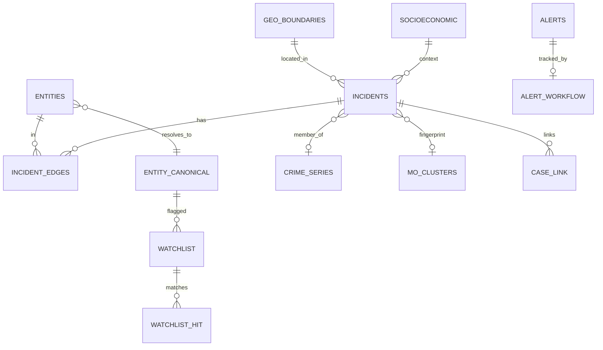

# GARUDA — Backend Schema & Data Model

**Companion to:** `schema/canonical_schema.yaml` (implemented) · `docs/DATASET_REAL_SCHEMA.md`
(organizer source) · [02-TRD](02-TRD.md).

---

## 1. Philosophy

A **canonical layer** decouples engines/UI from any source. Engines read/write only canonical tables;
the **adapter** maps the real KSP schema (or synthetic) onto them. Join columns are **Text business
keys** (`incident_id`, `entity_id`, `canonical_id`) — not Catalyst ROWID — so CSV-generated data and
ZCQL joins both work (loader can remap to true FKs post-insert). Catalyst auto-adds `ROWID,
CREATORID, CREATEDTIME, MODIFIEDTIME` to every table.

## 2. Storage strategy (what lives where)

| Store | Holds | Why |
|---|---|---|
| **Data Store (ZCQL)** | canonical core + derived tables (Incidents, Entities, Edges, Crime_Series, Alerts, Predictive_Risk, Audit_Log, Watchlist…) | relational joins, aggregations, the spine |
| **NoSQL** | ego-subgraph cache, narrative embeddings (vectors), MO vectors | fast key/vector lookup, hot graph reads |
| **Stratus** | raw FIR scans, generated PDFs/briefs, model artifacts, large GeoJSON | object storage |
| **Cache** | hot analytics (risk surface, top rings, dashboard stats) | sub-300ms reads, TTL |

## 3. Canonical core (built — Phase 2; Officers/Chargesheets built Iteration 12)

**`Incidents`** (spine; business key `incident_id`): `fir_no, occurred_at, reported_at,
district_code, station_code, crime_type, ipc_bns_code, lat, long, address_text, mo_text, status,
case_category{FIR|UDR|PAR|Zero-FIR}, gravity{Heinous|Non-Heinous}, officer_id,
mo_cluster_id`(P4)`, series_id`(P5)`, source_fir_url, confidence, created_by`.
**`Entities`** (`entity_id`): `canonical_id, type{person|vehicle|phone}, value, alias_of, age,
gender, match_confidence`.
**`Incident_Edges`** (graph): `incident_id, entity_id, role{suspect|victim|witness|vehicle_used|
phone_used}, edge_weight, evidence_type{fir_named|cctv|recovered|call_record|witness}`.
**`Socioeconomic`** (`area_code`): `population, density, literacy, urbanization`.
**`Geo_Boundaries`** (`area_code`): `level, polygon(GeoJSON text)`.
**`Officers`** (`officer_id` — organizer `Employee`, narrowed): `name, rank, designation,
district_code, unit_code`.
**`Chargesheets`** (`cs_id` — organizer `ChargesheetDetails`): `incident_id, cs_date,
cs_type{A=Chargesheet|B=False Case|C=Undetected}, officer_id`. Powers the District Command
Card's clearance rate (`app/engines/district.py`, `GET /district/{code}/command`,
`GET /district/rank`) — blueprint §B1, no longer just planned.

## 4. Derived / analytics tables (built P4–P6)

| Table | Key cols | Engine |
|---|---|---|
| **MO_Clusters** | `cluster_id, crime_type, size, label, centroid_features(JSON), exemplar_incident_id` | MO |
| **Crime_Series** | `series_id, crime_type, district_code, locality, start/end_date, incident_count, method` | series |
| **Alerts** | `alert_id, type, district_code, crime_type, severity, window_start/end, detail, status` | anomaly |
| **Predictive_Risk** | `grid_id, district_code, crime_type, period, risk_score, rank, top_drivers(JSON SHAP), model_version, backtest_pai` | forecast |
| **Audit_Log** | `log_id, actor, role, action, resource, query_text, ts, ip` | copilot/governance |

## 5. New tables for V1 (this blueprint)

| Table | Key cols | Powers |
|---|---|---|
| **Entity_Canonical** (dossier head) | `canonical_id, primary_value, type, n_incidents, districts(JSON), first_seen, last_seen, recidivism_score, risk_indicator, drivers(JSON)` | E3 dossier |
| **Entity_Alias** | `canonical_id, entity_id, value, match_confidence` | alias lineage |
| **Case_Link** | `incident_id_a, incident_id_b, link_type{shared_entity|mo_cluster|series|near_repeat}, evidence, score` | E2 linked cases |
| **Watchlist** | `watch_id, type, value, canonical_id, reason, legal_basis, created_by, created_at, expires_at, status` | E11 BOLO |
| **Watchlist_Hit** | `hit_id, watch_id, incident_id, matched_at, context(JSON)` | BOLO match |
| **Alert_Workflow** | `alert_id, state, assignee, ack_at, resolved_at, disposition` | E10 lifecycle |
| **Brief** | `brief_id, scope, period, pdf_url(Stratus), recipients(JSON), sources(JSON), created_at` | E13 briefs |
| **Patrol_Tasking** | `task_id, grid_id, period, risk_score, state, approved_by, approved_at` | E7 tasking |
| **Network_Adj** (NoSQL) | `canonical_id → {neighbors, weights, community, centrality}` | E4 fast graph |
| **Saved_Query** | `query_id, user, text, filters(JSON), created_at` | E9/E12 |
| **Model_Card** | `model, version, purpose, data, metrics(JSON), limits, trained_at, fairness(JSON)` | E15 trust |

## 6. Source → canonical mapping (real KSP schema)

From `docs/DATASET_REAL_SCHEMA.md`. The adapter's column-map targets these:

| Canonical | Real source |
|---|---|
| `Incidents.incident_id` / `fir_no` | `CaseMaster.CaseMasterID` / `CrimeNo` |
| `occurred_at` / `reported_at` | `IncidentFromDate` / `CrimeRegisteredDate`,`InfoReceivedPSDate` |
| `district_code` / `station_code` | decode `CrimeNo` (1+4+4+4+5) or `Unit→District` / `PoliceStationID` |
| `crime_type` | `CrimeSubHead.CrimeHeadName` (+`CrimeHead` group) |
| `ipc_bns_code` | `ActSectionAssociation` (`Act.ActCode`+`Section.SectionCode`) — primary/most-serious |
| `lat`/`long`, `mo_text`/`address_text`, `status` | `latitude`/`longitude`, `BriefFacts`, `CaseStatusMaster` |
| `Entities`(person) + `Incident_Edges` | `Complainant`/`Victim`/`Accused` → role; value/age/gender |
| `Entities`(phone/vehicle) | **not structured in source → Phase-3 NER over `BriefFacts`** |
| outcomes | `ChargesheetDetails` → `Chargesheets` **[built]** (clearance rate, District Command §B1); `ArrestSurrender` still future (needed for the statutory deadline tracker, [08 §9](08-FIELD-OFFICER-INTELLIGENCE.md)) |

> **Critical:** the source has **no phone/vehicle tables** — the co-offender hero depends on the
> ingestion NER mining `BriefFacts` (possibly Kannada). Keep that extractor strong.

## 7. ER (canonical, simplified)

## 8. Indexing & query patterns

- **Indexes:** `Incidents(district_code, crime_type, occurred_at)`, `Incident_Edges(entity_id)`,
  `Incident_Edges(incident_id)`, `Entities(canonical_id)`, `Entities(value)`,
  `Predictive_Risk(district_code, period)`, `Alerts(status, severity)`, `Audit_Log(ts)`.
- **Hot patterns (ZCQL):** rings = `Edges ⋈ Entities ⋈ Incidents` grouped by shared phone/vehicle;
  dossier = all `Edges`+`Incidents` for a `canonical_id`; map = counts by `district_code`; series =
  `Crime_Series`. Heavy graph/forecast are **batch + cached** (Job Scheduling → Cache/NoSQL), not
  per-request.

## 9. Data dictionary & governance

- **Enums:** `crime_type` (16 synthetic → real `CrimeSubHead`); `role`; `evidence_type`; `severity`
  {high|medium}; `status` (FIR: Under Investigation|Chargesheeted|Closed); `type` {person|vehicle|phone};
  `case_category` {FIR|UDR|PAR|Zero-FIR} **[built]**; `gravity` {Heinous|Non-Heinous} **[built]**;
  `cs_type` {A=Chargesheet|B=False Case|C=Undetected} **[built]**.
- **PII classification:** *High* — person names, ages, addresses, phones (mask to initials/partial by
  role). *Medium* — vehicle plates (mask for non-jurisdiction). *Low* — crime_type, district, dates,
  sections. **Never used as model features:** caste, religion, gender.
- **Masking:** applied at the API layer per RBAC scope; raw PII never in logs/URLs/exports without
  `admin` + audit.
- **Retention & lineage:** source scans in Stratus with retention policy; canonical rows carry
  `source_fir_url` + `created_by`; resolution preserves `alias_of` lineage; deletions soft + audited.

## 10. Real-data swap procedure

1. Run `docs/GARUDA_DATA_READINESS.md` runbook on a sample. 2. Set the adapter column-map (§6).
3. `ingestion/adapter/validate.py` (the gate). 4. Bulk load → canonical. 5. Run resolution + MO.
6. Re-run the engine test suite. **No engine code changes** — only the column-map.
